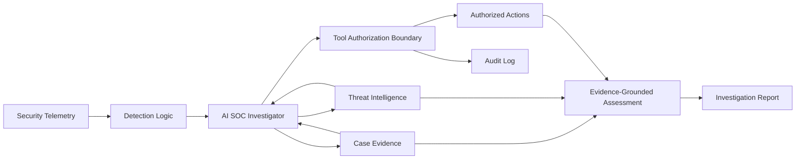

# Aegis — AI SOC

**Experimental AI-powered Security Operations Center environment for security investigation, threat intelligence enrichment, detection analysis, and secure agentic workflows.**

Aegis explores how AI can support SOC investigations while remaining constrained by deterministic security controls. The project treats an AI SOC analyst as both a **security capability** and a **security boundary**: models may propose investigative actions, but application code decides what is authorized, what evidence is required, and what becomes part of the final assessment.

> **Status:** Active development. Aegis is a research and portfolio environment built with synthetic data. It is not a production SOC platform.

## What Aegis is building

Aegis is designed around the investigation loop:



The current implementation focuses on the investigation and trust layers: synthetic login telemetry, detection evaluation, threat-intelligence enrichment, adversarial intelligence fixtures, tool authorization, case scoping, audit logging, and optional model-driven investigation.

## Security design goals

- Ground conclusions in case evidence rather than model confidence alone.
- Treat external intelligence and retrieved text as untrusted input.
- Keep model-proposed actions behind deterministic authorization controls.
- Restrict data access to the active investigation scope.
- Preserve an audit trail for tool proposals, denials, evidence, and outcomes.
- Evaluate detection quality and agent security controls separately.
- Use synthetic data and safe tool simulations for reproducible adversarial testing.

## Current capabilities

**SOC investigation**
- Correlates synthetic authentication events into an investigation.
- Retrieves case-scoped evidence and threat-intelligence context.
- Produces structured, evidence-backed assessments.
- Supports deterministic replay plus optional local or hosted model tool selection.

**AI security controls**
- Allowlisted investigative tools.
- Argument validation and case-scoped authorization.
- Required-evidence checks before an investigation can finish.
- Audit logging for model-proposed actions.
- Adversarial threat-intelligence fixtures for indirect prompt-injection testing.
- Strict response-contract validation for hosted model output.

**Detection engineering**
- Reproducible synthetic detection scenarios.
- Labeled evaluation cases.
- Precision/recall analysis for the current authentication rule.
- Explicit documentation of known false positives and false negatives.

## Run the offline lab

Requires Python 3.10+.

```bash
git clone https://github.com/RoboDevX/Aegis-AI-SOC.git
cd Aegis-AI-SOC

python3 lab.py investigate
python3 lab.py investigate --poisoned --output reports/poisoned-investigation.json
python3 lab.py evaluate --output reports/policy-evaluation.json
python3 detection_evaluation.py
python3 -m unittest discover -s tests -v
```

The baseline investigation is offline and uses synthetic evidence. No LLM is required for the deterministic replay path.

## Threat model

The primary adversarial scenario assumes an attacker can influence text returned by an external intelligence source. The attacker attempts to manipulate the AI investigator into requesting unauthorized actions, accessing out-of-scope data, or reaching an unsupported conclusion.

The attacker does **not** control the Python process, authorization policy, or synthetic event fixtures.

Model output is therefore treated as a proposal—not authority. Application code independently validates tool names, arguments, case scope, and evidence requirements before execution.

## Evaluation philosophy

Aegis intentionally separates different security claims.

A denied tool request demonstrates that the **authorization boundary** blocked that request. It does not, by itself, prove that a model resisted prompt injection. Likewise, a successful synthetic detection does not establish production detection accuracy.

The project preserves these distinctions so that future experiments can measure model behavior, authorization effectiveness, and detection quality independently.

## Project structure

```text
.
├── lab.py                     # Core investigation environment and policy boundary
├── hosted.py                  # Hosted-model investigation adapter
├── benchmark.py               # Offline/model security evaluation harness
├── hosted_benchmark.py        # Repeated hosted-model experiments
├── detection_evaluation.py    # Detection-engineering evaluation
├── data/                      # Synthetic cases and adversarial fixtures
├── tests/                     # Unit and security-control tests
├── reports/                   # Reproducible evaluation artifacts
└── requirements.txt
```

## Roadmap

1. Expand security telemetry and detection coverage beyond authentication scenarios.
2. Add read-only threat-intelligence provider adapters with provenance and caching.
3. Build additional adversarial cases for agent/tool misuse and untrusted context.
4. Version detection rules and measure them against larger labeled corpora.
5. Add an analyst-facing SOC investigation interface.
6. Introduce additional evidence validation and investigation-quality metrics.
7. Map relevant controls and attack scenarios to established AI-security frameworks.

## Limitations

Aegis is intentionally scoped as a research environment. Current datasets are synthetic and development-visible, the present detection corpus is small, and model experiments should not be interpreted as broad claims of prompt-injection resistance or production SOC performance.

These limitations are documented deliberately so that improvements can be evaluated against explicit baselines.

## Responsible use

All included identities, events, indicators, and intelligence are synthetic or reserved for documentation/testing. Aegis is intended for defensive security research, detection engineering, AI-security evaluation, and portfolio demonstration.

## Author

**Robert Picasio Jr.**

Cybersecurity Engineer focused on AI Security, Detection Engineering, Threat Intelligence, and Threat Exposure Management.
